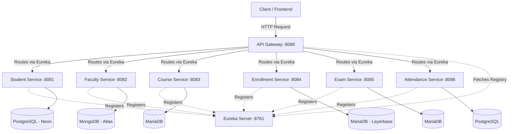

# College Management System - Microservices

A Spring Boot multi-module microservices architecture using Spring Cloud, Eureka, API Gateway, and SOAP web services.

## Architecture Diagram



## List of Services and Local Ports
When running locally, the services will fall back to the following ports:

- **api-gateway** = `8080`
- **student-service** = `8081`
- **faculty-service** = `8082`
- **course-service** = `8083`
- **enrollment-service** = `8084`
- **exam-service** = `8085`
- **attendance-service** = `8086`
- **eureka-server** = `8761`

> [!IMPORTANT]
> The ports above are **local fallbacks**. In production (e.g. on Render), the `PORT` environment variable will automatically be supplied and used.

## Required Environment Variables

When deploying to Render, set these environment variables (we recommend using an Environment Group):

**Global Variables:**
- `EUREKA_URL` : The full URL to your deployed Eureka server (e.g. `https://college-eureka.onrender.com/eureka/`)

**Database Variables:**
- `STUDENT_DB_URL`, `STUDENT_DB_USERNAME`, `STUDENT_DB_PASSWORD` (PostgreSQL)
- `FACULTY_MONGODB_URI`, `FACULTY_DB_NAME` (MongoDB)
- `COURSE_DB_URL`, `COURSE_DB_USERNAME`, `COURSE_DB_PASSWORD` (MariaDB)
- `ENROLLMENT_DB_URL`, `ENROLLMENT_DB_USERNAME`, `ENROLLMENT_DB_PASSWORD` (MariaDB)
- `EXAM_DB_URL`, `EXAM_DB_USERNAME`, `EXAM_DB_PASSWORD` (MariaDB)
- `ATTENDANCE_DB_URL`, `ATTENDANCE_DB_USERNAME`, `ATTENDANCE_DB_PASSWORD` (PostgreSQL)

## How to Run Locally

1. **Start Eureka Server First:**
   ```bash
   cd eureka-server
   ./mvnw spring-boot:run
   ```
2. **Start the Domain Services:**
   In separate terminals, navigate to each service directory (`student-service`, `course-service`, etc.) and run `./mvnw spring-boot:run`. Because of the `EUREKA_URL` fallback (`http://localhost:8761/eureka/`), they will automatically register.
3. **Start the API Gateway:**
   ```bash
   cd api-gateway
   ./mvnw spring-boot:run
   ```

## Render Deployment Explanation

Each microservice is designed to be deployed as an independent **Web Service** on Render. 

1. **Build Command:** `./mvnw clean package -DskipTests` (run this inside the root directory, but configure Render's Root Directory to the specific service folder, e.g., `student-service`).
2. **Start Command:** `java -jar target/*.jar`
3. **Ports:** Render will automatically assign a `PORT` variable. Do not hardcode ports.
4. **Health Checks:** Every service exposes `/actuator/health`. Configure Render to use this path for HTTP health checks.

### Render Deployment Order
1. Deploy **Eureka Server** first and copy its final `.onrender.com` URL.
2. Add the `EUREKA_URL` to your Render Environment Group.
3. Deploy all the **Domain Services** (Student, Course, Faculty, etc.).
4. Deploy the **API Gateway** last.

## Gateway URLs & Routing
The Gateway strips the first path segment and forwards requests to the appropriate service using Eureka Load Balancing (`lb://`):

- `http://localhost:8080/student/...` -> `STUDENT-SERVICE`
- `http://localhost:8080/course/...` -> `COURSE-SERVICE`
- `http://localhost:8080/faculty/...` -> `FACULTY-SERVICE`
- `http://localhost:8080/enrollment/...` -> `ENROLLMENT-SERVICE`
- `http://localhost:8080/exam/...` -> `EXAM-SERVICE`
- `http://localhost:8080/attendance/...` -> `ATTENDANCE-SERVICE`

## SOAP WSDL URLs
Through the gateway, you can access the WSDL definitions for each service:
- Student: `http://localhost:8080/student/ws/student.wsdl`
- Course: `http://localhost:8080/course/ws/course.wsdl`
- Faculty: `http://localhost:8080/faculty/ws/faculty.wsdl`
- Enrollment: `http://localhost:8080/enrollment/ws/enrollment.wsdl`
- Exam: `http://localhost:8080/exam/ws/exam.wsdl`
- Attendance: `http://localhost:8080/attendance/ws/attendance.wsdl`
